# Raspberry Pi + Python + Breadboard: LED Control Guide

## Table of Contents

1. [What You'll Need](#what-youll-need)
2. [Understanding the Breadboard](#understanding-the-breadboard)
3. [Raspberry Pi GPIO Basics](#raspberry-pi-gpio-basics)
4. [Circuit Theory Basics](#circuit-theory-basics)
5. [Building Your First LED Circuit](#building-your-first-led-circuit)
6. [Python Code to Control the LED](#python-code-to-control-the-led)
7. [Troubleshooting](#troubleshooting)
8. [Next Steps](#next-steps)

## What You'll Need

### Hardware

- **Raspberry Pi** (any model with GPIO pins - Pi 3, 4, or Zero W recommended)
- **MicroSD card** (16GB+) with Raspberry Pi OS installed
- **Breadboard** (half-size or full-size)
- **LEDs** (5mm, any color - red/green/blue work great)
- **Resistors** (220Ω or 330Ω - these protect your LED)
- **Jumper wires** (male-to-male and male-to-female)
- **Power supply** for your Raspberry Pi

### Software

- **Raspberry Pi OS** (formerly Raspbian)
- **Python 3** (pre-installed on Raspberry Pi OS)
- **GPIO Zero library** (pre-installed, but we'll show alternatives too)

## Understanding the Breadboard

### What is a Breadboard?

A breadboard is a reusable platform for building electronic circuits without soldering. It's perfect for prototyping and learning!

### Breadboard Anatomy

```
      a  b  c  d  e     f  g  h  i  j
   +-----------------+  +-----------------+
 1 | ●  ●  ●  ●  ●  |  | ●  ●  ●  ●  ●  |
 2 | ●  ●  ●  ●  ●  |  | ●  ●  ●  ●  ●  |
 3 | ●  ●  ●  ●  ●  |  | ●  ●  ●  ●  ●  |
 . | .  .  .  .  .  |  | .  .  .  .  .  |
 . | .  .  .  .  .  |  | .  .  .  .  .  |
30 | ●  ●  ●  ●  ●  |  | ●  ●  ●  ●  ●  |
   +-----------------+  +-----------------+
            ↑  gap (left a–e not connected to right f–j)

Power rails (long vertical buses on the sides):
  + : + + + + + + + + + + + + + + + + + + + + +
  - : - - - - - - - - - - - - - - - - - - - - -

Row connections:
  a–e are connected together per row; f–j are connected together per row.
  Rails run vertically and are all connected along their length.
```

### Key Points:

- **Tie Points**: The holes where you insert components
- **Rows**: Horizontal lines (1-30 typically)
- **Columns**: Vertical lines (a-j typically)
- **Center Gap**: Separates left side (a-e) from right side (f-j)
- **Power Rails**: The long strips on sides (+ and -) for power distribution

### How Connections Work:

- **Horizontal rows**: Points a-e are connected together, f-j are connected together
- **Vertical power rails**: All points in each rail are connected
- **Center gap**: No connection between left and right sides of a row

## Raspberry Pi GPIO Basics

### What is GPIO?

**GPIO** = **G**eneral **P**urpose **I**nput/**O**utput pins. These are the physical pins on your Raspberry Pi that you can control with code.

### Raspberry Pi Pin Layout (40-pin models):

```
Physical | Left Pin            | Right Pin             | Physical
-----------------------------------------------------------------
   1     | 3V3                 | 5V                    |    2
   3     | GPIO2  (SDA1)       | 5V                    |    4
   5     | GPIO3  (SCL1)       | GND                   |    6
   7     | GPIO4               | GPIO14 (TXD)          |    8
   9     | GND                 | GPIO15 (RXD)          |   10
  11     | GPIO17              | GPIO18 (PWM0)         |   12
  13     | GPIO27              | GND                   |   14
  15     | GPIO22              | GPIO23                 |   16
  17     | 3V3                 | GPIO24                 |   18
  19     | GPIO10 (MOSI)       | GND                    |   20
  21     | GPIO9  (MISO)       | GPIO25                 |   22
  23     | GPIO11 (SCLK)       | GPIO8  (CE0)           |   24
  25     | GND                 | GPIO7  (CE1)           |   26
  27     | ID_SD               | ID_SC                  |   28
  29     | GPIO5               | GND                    |   30
  31     | GPIO6               | GPIO12 (PWM0)          |   32
  33     | GPIO13 (PWM1)       | GND                    |   34
  35     | GPIO19 (PCM_FS)     | GPIO16                 |   36
  37     | GPIO26              | GPIO20 (PCM_D0)        |   38
  39     | GND                 | GPIO21 (PCM_D1)        |   40
```

### Important Pins for Beginners:

- **GPIO pins** (like GPIO18, GPIO24): Can be set HIGH (3.3V) or LOW (0V)
- **GND pins** (Ground): Complete the circuit - electricity flows back here
- **3.3V pins**: Provide constant 3.3V power
- **5V pins**: Provide constant 5V power (be careful - can damage components!)

## Circuit Theory Basics

### Ohm's Law (The Foundation)

**V = I × R**

- **V** = Voltage (Volts)
- **I** = Current (Amps)
- **R** = Resistance (Ohms)

### Why Do LEDs Need Resistors?

- LEDs have very low resistance
- Without a resistor, too much current flows through
- Too much current = burnt LED! 💥
- Resistor limits current to safe levels

### LED Polarity

LEDs are **polarized** - they only work one way:

- **Anode** (+): Longer leg, goes to positive voltage
- **Cathode** (-): Shorter leg, goes to ground (GND)

### Calculating Resistor Value

For a typical LED with Raspberry Pi:

- **Raspberry Pi GPIO voltage**: 3.3V
- **LED forward voltage**: ~2V (red), ~3V (blue/white)
- **Safe LED current**: 10-20mA (0.01-0.02A)

**Example calculation for red LED:**

- Voltage across resistor = 3.3V - 2V = 1.3V
- Desired current = 0.015A (15mA)
- R = V/I = 1.3V / 0.015A = 87Ω

**Use 220Ω or 330Ω resistor** (common values that work well)

## Building Your First LED Circuit

### Step-by-Step Instructions

#### Step 1: Power Off Your Raspberry Pi

**Always build circuits with power off!**

#### Step 2: Gather Your Components

- 1 LED
- 1 resistor (220Ω or 330Ω)
- 2 jumper wires (male-to-female)
- Breadboard

#### Step 3: Insert the LED

1. Find row 10 on your breadboard
2. Insert LED's **long leg (anode)** into hole **10a**
3. Insert LED's **short leg (cathode)** into hole **10b**

#### Step 4: Add the Resistor

1. Insert one end of resistor into hole **10c** (same row as LED cathode)
2. Insert other end into hole **12c**

#### Step 5: Connect to Raspberry Pi

1. Connect **male-to-female jumper wire** from **Raspberry Pi GPIO18 (pin 12)** to breadboard hole **10e** (same row as LED anode)
2. Connect **male-to-female jumper wire** from **Raspberry Pi GND (pin 14)** to breadboard hole **12a** (same row as resistor)

#### Circuit Diagram

```
Raspberry Pi                    Breadboard

GPIO18 (pin 12) ----wire-----> 10e
                               10a: LED anode (+)
                               10b: LED cathode (-)
                               10c: Resistor
                               12c: Resistor
GND (pin 14) -------wire-----> 12a
```

#### Visual Circuit Flow

```
GPIO18 → LED anode → LED cathode → Resistor → GND
(3.3V when HIGH)              (limits current)  (0V)
```

#### Mermaid Wiring Diagram (conceptual)

```mermaid
graph TD
  subgraph "Raspberry Pi (40-pin)"
    P12["GPIO18 (pin 12)"]
    P14["GND (pin 14)"]
  end

  P12 -- "jumper wire" --> A["Breadboard row 10e"]
  A --> LEDA["LED anode (row 10a)"]
  LEDA --> LEDC["LED cathode (row 10b)"]
  LEDC --> R1["Resistor (row 10c → 12c)"]
  R1 --> GNDROW["Row 12a (to GND)"]
  GNDROW -- "jumper wire" --> P14

  classDef pin fill:#eef,stroke:#99f,stroke-width:1px;
  classDef node fill:#efe,stroke:#9c9,stroke-width:1px;
  class P12,P14 pin;
  class A,LEDA,LEDC,R1,GNDROW node;
```



#### Exact Wiring Map

| From (Source)            | To (Destination)   | Notes                       |
| ------------------------ | ------------------ | --------------------------- |
| GPIO18 (physical pin 12) | Breadboard row 10e | Drives LED anode via row 10 |
| LED anode (long leg)     | Breadboard row 10a | Same row as 10e (connected) |
| LED cathode (short leg)  | Breadboard row 10b | Connected to resistor       |
| Resistor end 1           | Breadboard row 10c | Same row as LED cathode     |
| Resistor end 2           | Breadboard row 12c | Moves to a new row to GND   |
| GND (physical pin 14)    | Breadboard row 12a | Completes circuit to ground |

## Python Code to Control the LED

### Method 1: Using GPIO Zero (Recommended for Beginners)

#### Install GPIO Zero (if needed)

```bash
sudo apt update
sudo apt install python3-gpiozero
```

#### Basic LED Control Script

Create a file called `led_control.py`:

```python
from gpiozero import LED
from time import sleep

# Create LED object connected to GPIO18
led = LED(18)

print("LED Control Program")
print("Starting LED blink sequence...")

try:
    # Blink LED 10 times
    for i in range(10):
        print(f"Blink {i+1}: LED ON")
        led.on()          # Turn LED on
        sleep(0.5)        # Wait 0.5 seconds

        print(f"Blink {i+1}: LED OFF")
        led.off()         # Turn LED off
        sleep(0.5)        # Wait 0.5 seconds

    print("Blink sequence complete!")

except KeyboardInterrupt:
    print("\nProgram interrupted by user")

finally:
    led.off()  # Make sure LED is off when program ends
    print("LED turned off. Program ended.")
```

#### Interactive LED Control Script

Create `led_interactive.py`:

```python
from gpiozero import LED
import time

led = LED(18)

print("Interactive LED Control")
print("Commands:")
print("  'on' or '1' - Turn LED on")
print("  'off' or '0' - Turn LED off")
print("  'blink' - Blink LED 5 times")
print("  'quit' or 'q' - Exit program")
print()

try:
    while True:
        command = input("Enter command: ").lower().strip()

        if command in ['on', '1']:
            led.on()
            print("LED is ON")

        elif command in ['off', '0']:
            led.off()
            print("LED is OFF")

        elif command == 'blink':
            print("Blinking LED 5 times...")
            for i in range(5):
                led.on()
                time.sleep(0.3)
                led.off()
                time.sleep(0.3)
            print("Blink complete")

        elif command in ['quit', 'q']:
            break

        else:
            print("Unknown command. Try 'on', 'off', 'blink', or 'quit'")

except KeyboardInterrupt:
    print("\nProgram interrupted")

finally:
    led.off()
    print("LED turned off. Goodbye!")
```

### Method 2: Using RPi.GPIO Library

#### Install RPi.GPIO (if needed)

```bash
sudo apt install python3-rpi.gpio
```

#### Basic RPi.GPIO Script

Create `led_rpi_gpio.py`:

```python
import RPi.GPIO as GPIO
import time

# Set up GPIO
GPIO.setmode(GPIO.BCM)  # Use BCM pin numbering
GPIO.setup(18, GPIO.OUT)  # Set GPIO18 as output

print("LED Control with RPi.GPIO")

try:
    # Blink LED 10 times
    for i in range(10):
        print(f"LED ON - Blink {i+1}")
        GPIO.output(18, GPIO.HIGH)  # Turn LED on (3.3V)
        time.sleep(0.5)

        print(f"LED OFF - Blink {i+1}")
        GPIO.output(18, GPIO.LOW)   # Turn LED off (0V)
        time.sleep(0.5)

except KeyboardInterrupt:
    print("\nProgram interrupted")

finally:
    GPIO.cleanup()  # Reset GPIO pins
    print("GPIO cleaned up. Program ended.")
```

### Running Your Code

1. **Save your Python file** (e.g., `led_control.py`)
2. **Open terminal** on Raspberry Pi
3. **Navigate to your file location**:
   ```bash
   cd /home/pi/Desktop  # or wherever you saved the file
   ```
4. **Run the script**:
   ```bash
   python3 led_control.py
   ```

## Troubleshooting

### LED Not Working?

#### Check Your Wiring

- **LED orientation**: Long leg to GPIO pin, short leg toward GND
- **Secure connections**: Push wires firmly into breadboard holes
- **Correct pins**: GPIO18 (pin 12) and GND (pin 14)

#### Check Your Code

- **Correct GPIO number**: Using GPIO18 (not pin number 18)
- **Proper imports**: Make sure libraries are installed
- **Run as user pi**: Some GPIO libraries need proper permissions

#### Common Issues and Solutions

| Problem              | Possible Cause         | Solution                                         |
| -------------------- | ---------------------- | ------------------------------------------------ |
| LED doesn't light up | LED backwards          | Flip the LED (swap anode/cathode)                |
| LED very dim         | Resistor too high      | Try 220Ω instead of higher values                |
| LED burnt out        | No resistor used       | Replace LED, add resistor                        |
| Permission denied    | Not running as pi user | Run with `sudo` or log in as pi                  |
| ImportError          | Library not installed  | Install with `sudo apt install python3-gpiozero` |
| LED stays on         | GPIO not cleaned up    | Add `GPIO.cleanup()` or restart Pi               |

### Testing Your Circuit

#### Manual Test (No Code)

1. **Power off Pi**
2. **Connect LED anode** to **3.3V pin (pin 1)**
3. **Connect LED cathode** through resistor to **GND**
4. **Power on Pi**
5. **LED should light up** - if not, check wiring

#### Multimeter Testing (Advanced)

- **Voltage across LED**: Should be ~2V (red) or ~3V (blue/white)
- **Current through circuit**: Should be 10-15mA
- **GPIO pin voltage**: 3.3V when HIGH, 0V when LOW

## Next Steps

### Immediate Next Projects

1. **Multiple LEDs**: Control 3 LEDs independently
2. **LED Patterns**: Create traffic light sequences
3. **Button Input**: Use a button to control LED
4. **PWM (Pulse Width Modulation)**: Dim LEDs smoothly
5. **RGB LED**: Control color-changing LEDs

### Expanding Your Skills

#### More Components to Try

- **Buttons and switches**
- **Potentiometers** (variable resistors)
- **Buzzers** (make sounds)
- **Servo motors** (precise movement)
- **Temperature sensors**
- **Ultrasonic distance sensors**

#### Programming Concepts

- **Functions**: Organize your code better
- **Classes**: Object-oriented LED control
- **Threading**: Run multiple things simultaneously
- **Web interfaces**: Control LEDs from web browser
- **GPIO interrupts**: React to button presses instantly

#### Advanced Projects

- **Home automation system**
- **Security alarm with sensors**
- **Weather station**
- **Robot control**
- **IoT projects** (Internet of Things)

### Learning Resources

#### Official Documentation

- [GPIO Zero Documentation](https://gpiozero.readthedocs.io/)
- [Raspberry Pi Foundation](https://www.raspberrypi.org/documentation/)

#### Online Communities

- **r/raspberry_pi** (Reddit)
- **Raspberry Pi Forums**
- **MagPi Magazine** (free PDF downloads)

#### Books for Beginners

- "Learn Robotics with Raspberry Pi" by Matt Timmons-Brown
- "Raspberry Pi Cookbook" by Simon Monk
- "Programming the Raspberry Pi" by Simon Monk

### Safety Reminders

#### Always Remember

- **Power off** when building circuits
- **Double-check connections** before powering on
- **Use resistors** with LEDs
- **Don't exceed 3.3V** on GPIO pins
- **Don't draw too much current** (max ~50mA per pin)

#### If Something Goes Wrong

- **Smoke/burning smell**: Immediately disconnect power
- **Component gets hot**: Turn off and check circuit
- **Pi won't boot**: Check for short circuits

---

## Quick Reference

### GPIO Zero LED Commands

```python
led = LED(18)      # Create LED on GPIO18
led.on()           # Turn on
led.off()          # Turn off
led.toggle()       # Switch state
led.blink()        # Blink forever
led.pulse()        # Fade in/out forever
```

### Common Resistor Values for LEDs

- **220Ω**: Bright LED
- **330Ω**: Medium brightness
- **470Ω**: Dimmer LED
- **1kΩ**: Very dim LED

### Raspberry Pi GPIO Pin Quick Reference

- **GPIO18**: Pin 12
- **GPIO24**: Pin 18
- **GPIO25**: Pin 22
- **GND**: Pins 6, 9, 14, 20, 25, 30, 34, 39

---

**Congratulations!** You now have everything you need to start your journey with Raspberry Pi, Python, and electronics. Start with the basic LED circuit, get comfortable with the concepts, and then gradually work your way up to more complex projects. Remember: every expert was once a beginner, and the best way to learn is by doing!

Happy coding and building! 🔥💡🐍
